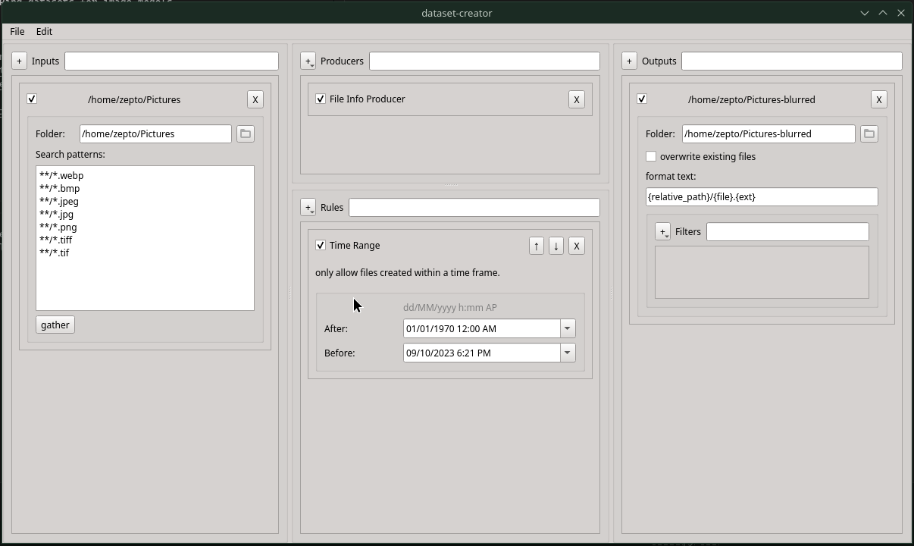
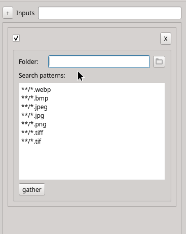
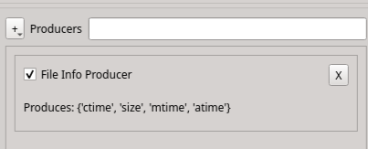
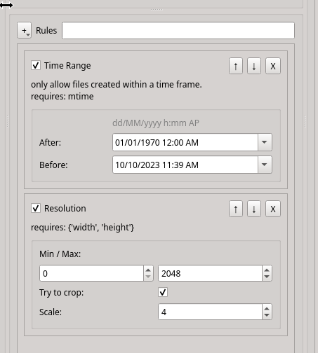
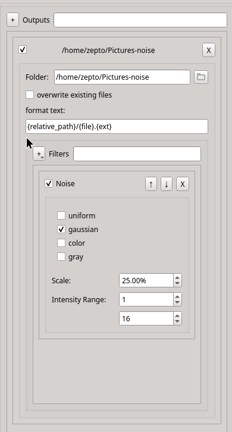

# dataset-creator

This is a tool I made to assist making datasets for image models.

## Installation

The simplest way to install is to run

```bash
git clone https://github.com/zeptofine/dataset-creator
cd dataset-creator
```

, create a virtual environment, then

```bash
pip install -e .
```

inside. Atm This basically just uses pyproject.toml (and Poetry) to install the dependencies. you can use the requirements.txt most of the time.

## GUI Configuration

This gui is (currently) used to configure the actions of the
[imdataset_creator](imdataset_creator) main.

To run it, you can execute `python -m imdataset_creator.gui` (or if you installed it, `imdataset-creator-gui`) in the terminal. When you save, the config will normally appear in `<PWD>/config.json`. Make sure it doesn't overwrite anything important!

### Inputs



The folder is what is searched through to find images, and the search patterns are used in [`wcmatch.glob`](https://facelessuser.github.io/wcmatch/glob/) to find files.

### Producers



Rules use producers to get information about files. Of course, Rules themselves could gather this information themselves but that is a little inefficient when it comes to multiple consecutive runs. The data saved by the producers will be saved to a file, by default `filedb.arrow`.

### Rules

Rules are used to filter out unwanted files. For example, one of them restricts the resolution of allowed files to a certain range, and another restricts the modification time within a certain range.



When a Rule needs a producer, the rule should tell you what it needs in its description. Pick the appropriate Producer in the Producers.

As of writing this, there are 6 rules:

- Time Range: only allows files created within a time frame.
- Blacklist and whitelist: Only allow paths that include `str`s in the whitelist and not in the blacklist
- Total count: Only allow a certain number of files
- Resolution: Only allow files with a resolution within a certain range
- Channels: Only allow files with a certain number of channels
- Hash: Uses ImageHash hashes to eliminate similar looking images.

The order of these rules in the list is important, as they will be executed in order from top to bottom.

**!Neither Producers or Rules need to be defined for inputs/outputs to work!**

### Outputs & Filters



Outputs have a folder, which is used to send created images, and the format_text is used to define files new paths. The `overwrite existing files` checkbox defines whether you overwrite existing files in the output folder if they already exist.

The `Filters` list show functions that will be applied to images going through this step. They can apply noise, compression, etc. to images. Many of these are nearly ripped from [Kim2091/helpful-scripts/Dataset-Destroyer](https://github.com/Kim2091/helpful-scripts/).

### Every list item can be dragged and resized to help viewing them

## Running

To run the actual program, run `python -m imdataset_creator` (or if you installed it, `imdataset-creator`) in the terminal.

### Arguments

```rich
--config-path                              PATH     Where the dataset config is placed [default: config.json]
--database-path                            PATH     Where the database is placed [default: filedb.arrow]
--threads                                  INTEGER  multiprocessing threads [default: 9]
--chunksize                                INTEGER  imap chunksize [default: 5]
--population-chunksize                     INTEGER  chunksize when populating the df [default: 100]
--population-interval                      INTEGER  save interval in secs when populating the df [default: 60]
--simulate                --no-simulate             stops before conversion [default: no-simulate]
--verbose                 --no-verbose              prints converted files [default: no-verbose]
--sort-by                                  TEXT     Which database column to sort by [default: path]
--help                                              Show this message and exit.
```

## TODO

- [x] make UI
- [x] redo config setup
- [ ] More filters
- [ ] bind UI to the CLI methods

Before the last point can be started, create_dataset.py must be broken down far enough such that almost all it is controlling is progress tracking.
